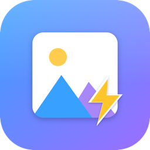

<p align="center">
  
</p>

<h1 align="center">Schnellbild</h1>

<p align="center">
  <a href="https://github.com/johanneshoppe/schnellbild/actions/workflows/ci.yml"></a>
</p>

A **fast** file/image viewer for macOS. Open a folder, see thumbnails,
view one image large, page through with the keyboard. Nothing more — but
without stalling, even over network volumes.

Born out of frustration with viewers that crawl over the network while
**macOS Preview** stays smooth. Schnellbild does exactly what Preview does:
read little, load in parallel, cache aggressively, never block the UI thread.

## Why so fast? (The four tricks)

1. **Riding on the system.** Thumbnails come from Apple's
   `QLThumbnailGenerator` (QuickLook). The framework automatically pulls
   **embedded previews** (EXIF thumbnail, JPEG-in-RAW) — a few KB instead of
   tens of MB over the network — and handles **any format** QuickLook knows
   (JPEG, PNG, HEIC, RAW, PSD, PDF …), including third-party plugins. The
   persistent cache lives in the system; we write **zero cache code**.

2. **Lazy & parallel.** The grid (`LazyVGrid`) only loads visible tiles. The
   system throttles thumbnail generation concurrently on its own.

3. **Full view downsampled.** The full-size view loads the real image, but via
   `ImageIO` (`CGImageSourceCreateThumbnailAtIndex`) sampled directly to screen
   size — no 8000px monster in RAM. The already-available thumbnail appears
   instantly as a placeholder.

4. **Nothing blocks the main thread.** Directory scanning and full decoding
   run in `Task.detached`.

## Build & Run

> **Requirement:** a full **Xcode** install (not just the Command Line Tools —
> those have no macOS platform metadata and can't build SwiftUI).

```bash
# Activate Xcode (one-time):
sudo xcode-select -s /Applications/Xcode.app/Contents/Developer
sudo xcodebuild -license accept

# In the project folder:
swift build
swift run        # starts the app
swift test       # run the unit tests
# …or open in Xcode:
open Package.swift
```

To produce a proper **`.app` bundle** (icon + Info.plist, ad-hoc signed):

```bash
./Scripts/build_app.sh      # → build/Schnellbild.app
```

The icon is generated from `Scripts/make_icon.swift` (CoreGraphics, no external
tools). CI builds, tests, and packages the app on every push; tagging `vX.Y.Z`
publishes a GitHub Release with the zipped app.

## Tests

Logic unit tests run via SwiftPM:

```bash
swift test
```

End-to-end UI tests use XCUITest, which needs an Xcode project generated from
`project.yml` with [xcodegen](https://github.com/yonaskolb/XcodeGen):

```bash
brew install xcodegen
xcodegen generate
xcodebuild test -project Schnellbild.xcodeproj -scheme Schnellbild \
  -destination 'platform=macOS' -only-testing:SchnellbildUITests
```

CI runs both on every push.

## Features

- **Folders & drag-and-drop.** Open a folder (⌘O) or drag one onto the window.
  Drag a single file to open it straight in the full view. Subfolders show up in
  the grid (folders first) with a Norton-style `..` tile to go up a level.
  Hidden files and folders are shown.
- **Thumbnails for everything QuickLook supports** — images, RAW, PSD, PDF, and
  a poster frame for videos.
- **Full view** with zoom (keyboard + trackpad pinch) and drag-to-pan.
- **Video** plays via AVKit (autoplay); formats macOS can't play natively
  (AVI, MKV, WebM …) fall back to "Open with default app".
- **Animated GIFs** play in the full view.
- **Slideshow**, **file inspector** (resolution/size/date), **sorting**
  (name/date/size), **Reveal in Finder**, **Open with default app**,
  **Move to Trash**, a status bar, and last-folder restore.

## Keyboard

Bindings follow [Phiewer](https://phiewer.com/) where it makes sense.

**Grid**

| Key | Action |
|---|---|
| ← → | previous / next item |
| ↑ ↓ | one row up / down |
| Return / Space | open image, or enter folder |
| Backspace | up one folder level |
| Home / End | first / last item |
| ⌘+ / ⌘− | larger / smaller thumbnails |

**Full view**

| Key | Action |
|---|---|
| ← → ↑ ↓ | previous / next item (always, even on video) |
| Space | image: next · video: play/pause |
| ⌘← / ⌘→ | video: seek −10 s / +10 s |
| ⌘+ / ⌘− (or + / −) | zoom in / out |
| 0 / 1 | fit to window / 100 % |
| [ / ] | rotate left / right (view only) |
| i | file info |
| s | slideshow |
| f | fullscreen |
| Esc / Backspace / Return | back to grid |

**Menus**

| Shortcut | Action |
|---|---|
| ⌘O | open folder |
| ⇧⌘R | reveal in Finder |
| ⌘↩ | open with default app |
| ⌘⌫ | move to Trash |

## Status

**Early stage, but already a usable daily driver.** Known open items:

- No `.app` bundle yet — no icon, no sandbox/entitlements (runs as a SwiftPM
  executable via `swift run`).
- Slideshow interval is fixed at 3 s.
- `1` (100 %) is approximate (assumes the main display's backing scale).
- Animated GIFs don't zoom/pan in the full view.
- AVI/MKV/WebM play only via an external app (no native macOS codecs).

## License

[MIT](LICENSE) © 2026 HAUS HOPPE - ITS (Johannes Hoppe)
